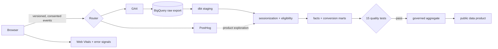

# Portfolio Intelligence Platform

**Status: complete · [Open the live data product](https://kush-portfolio-intelligence.kush007.chatgpt.site/)**

A portfolio-grade web analytics system that joins consent-aware browser instrumentation, governed event and metric contracts, reproducible dbt models, automated quality gates, and an interactive executive dashboard. The public experience uses a clearly labeled synthetic dataset; no demo values are presented as real visitor behavior.

## Why this exists

Page-view counters do not answer the questions a hiring portfolio actually creates: Which work earns attention? Where do evaluators stop? Do technical visitors return? Is the site fast for real users? Can anyone trust the numbers?

This project treats those questions as a small analytics product, with collection, identity, modeling, semantics, reliability, privacy, and presentation designed together.

## Two-minute reviewer tour

1. Change the 30 / 90 / 365-day range and inspect the KPI, acquisition, funnel, and project views.
2. Open **Metrics** to switch among acquisition, engagement, conversion, retention, experience, and data-health families.
3. Inspect p75 Core Web Vitals, a cohort matrix, and collection-quality service levels.
4. Open **Lineage** to see definitions, grain, ownership, freshness, and source-to-mart paths.
5. Review **Quality** for the 15-test gate and the local-to-production architecture.

## Architecture



The deterministic CI path runs on DuckDB, so every reviewer can reproduce the model without a cloud account. The production design swaps the adapter for BigQuery and consumes the GA4 export.

## Modern measurement coverage

| Family | Governed measures |
|---|---|
| Acquisition | users, new users, sessions, sessions/user, channel share, campaign conversion |
| Engagement | engaged sessions/rate/time, views/session, scroll completion, project depth |
| Conversion | high intent, resume view/download, GitHub CTR, contact rate, funnel completion |
| Retention | returning-user rate, W1/W4 retention, return frequency, evaluator return, days to return |
| Experience | LCP, INP, CLS, FCP and TTFB p75; good-CWV share; error-free sessions |
| Data health | contract/consent coverage, attribution coverage, duplicates, late arrivals, exclusions |

Exact formulas, grains, owners, exclusions, and service levels live in [`docs/metric-definitions.md`](docs/metric-definitions.md). The UI, documentation, and warehouse semantics use the same vocabulary.

## Credibility by design

- **Privacy boundary:** direct identifiers, free-form input, IP addresses, and query-string content are prohibited.
- **Consent first:** provider dispatch is disabled until analytics consent is granted.
- **Explicit identity:** pseudonymous visitor IDs and 30-minute inactivity sessions are first-party and versioned.
- **Honest demo:** `is_synthetic`, `is_internal`, bot, and automated-test flags preserve lineage while excluding ineligible rows.
- **Session-safe math:** conversions are deduplicated; period rates are recomputed from counts rather than averaged.
- **Performance as analytics:** LCP, INP, CLS, FCP, TTFB, and privacy-safe error categories share the event contract.
- **Controlled change:** breaking event or metric changes require versioning, migrations, tests, and owner review.

## Free-tier stack

| Layer | Tool | Reason |
|---|---|---|
| Collection | GA4 + PostHog adapters | complementary acquisition and product signals; public browser IDs only |
| Performance | PerformanceObserver | native Web Vitals and error-health capture without a paid SDK |
| Warehouse | BigQuery design / DuckDB demo | production-scale export path plus a zero-cost reproducible local path |
| Transformation | dbt Core | documented SQL lineage, tests, modular models, adapter portability |
| Automation | GitHub Actions templates | pull-request quality gate and scheduled production-build pattern |
| Data product | semantic HTML, CSS, vanilla JS | fast, accessible, dependency-light public experience |
| Hosting | ChatGPT Sites | HTTPS public showcase with no paid infrastructure |

No paid tool is required to review or run the project locally.

## Repository map

```text
analytics/       Consent-aware dispatcher and Web Vitals collection
dbt/             Seed, staging, sessions, facts, mart, macros, and tests
dist/            Deployed interactive analytics data product
docs/            Architecture, data model, event plan, metrics, and privacy
.github/         CI and scheduled production-build workflow templates
```

## Run it in under five minutes

Preview the data product:

```bash
python -m http.server 4173 --directory dist
```

Then open `http://localhost:4173`.

Reproduce the analytics pipeline with the free DuckDB adapter:

```bash
python -m venv .venv
# Windows: .venv\Scripts\activate
# macOS/Linux: source .venv/bin/activate
pip install dbt-duckdb==1.9.2
dbt seed --project-dir dbt --profiles-dir dbt
dbt build --project-dir dbt --profiles-dir dbt
```

Expected gate: **PASS across 20 dbt nodes, including 15 data tests**. The suite covers uniqueness, nullability, accepted values, relationships, session ordering, conversion bounds, and business-rule integrity.

## Data model and contract

```text
raw_events (deterministic seed or GA4 export)
  └─ stg_events            normalized and typed events
      └─ int_sessions      30-minute reconstruction + eligibility
          ├─ fct_sessions  one row per session
          └─ mart_conversion
```

The browser accepts only registered `snake_case` event names. Every payload adds a UUID, contract version, UTC timestamp, pseudonymous visitor ID, session ID, clean page path, consent state, and explicit internal/synthetic flags. See [`docs/event-tracking-plan.md`](docs/event-tracking-plan.md) and [`docs/data-model.md`](docs/data-model.md).

## Production activation

The adapters and warehouse target are intentionally scaffolded, not silently connected to personal accounts. To activate genuine traffic:

1. Create GA4 and PostHog projects and place only their public browser identifiers behind the consent manager.
2. Enable GA4’s BigQuery export in a dedicated raw dataset.
3. Configure least-privilege dbt credentials through environment secrets.
4. Validate internal, bot, test, and synthetic filters against known fixtures.
5. Replace the demo aggregate only after privacy review and a passing production build.
6. Add freshness and volume alerts before relying on the metrics operationally.

Never commit provider secrets or publish person-level event exports.

## Verification checklist

- [x] Interactive 30 / 90 / 365-day views
- [x] Six-family modern metric explorer
- [x] p75 Core Web Vitals and error-health measurement
- [x] Weekly retention cohorts
- [x] Metric contracts and interactive lineage
- [x] Consent-aware dual-provider router
- [x] Reproducible DuckDB/dbt pipeline
- [x] Fifteen automated data tests
- [x] Responsive and keyboard-accessible interface
- [x] Clearly labeled synthetic public data
- [x] Production activation and privacy boundary documented

## Deliberate limitations

- Public dashboard values are a fixed synthetic aggregate, so the demo remains deterministic and privacy-safe.
- GA4, PostHog, and BigQuery require account-specific IDs or credentials and are not activated in this repository.
- DuckDB exercises the transformation contract; production-scale partitioning and clustering are BigQuery concerns documented in [`docs/architecture.md`](docs/architecture.md).
- A real deployment should add consent-mode UI appropriate to its jurisdiction and legal review.

## License

Released under the [MIT License](LICENSE).
